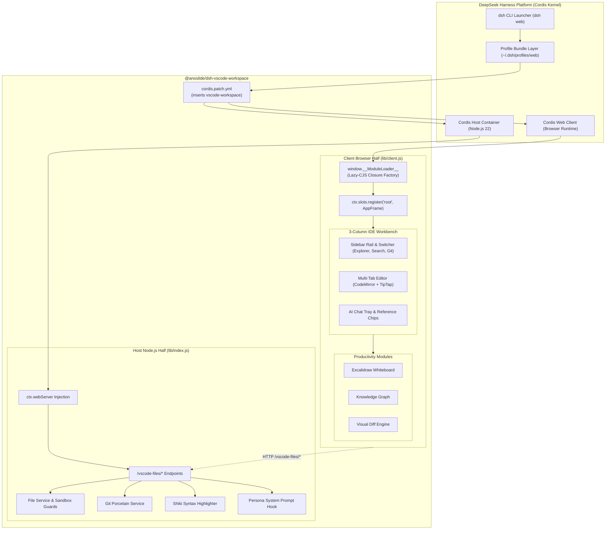

# @anoslide/dsh-vscode-workspace

> **Unified 3-Column VS Code Workspace, TipTap Notion WYSIWYG Suite, and Advanced AI Productivity Plugin for [DeepSeek Harness (`dsh`)](https://github.com/deepseek-ai/deepseek-harness).**

---

## 📖 Overview

`@anoslide/dsh-vscode-workspace` is an upstream-aligned, dual-face Cordis plugin for DeepSeek Harness. It unifies the entire backend workspace file services and modern IDE frontend into a single package, replacing legacy decoupled plugins (`@anoslide/dsh-host-files` and `@anoslide/dsh-client-vscode-layout`).

It combines:
- A **3-Column VS Code IDE Layout** (Explorer, Search, Git Source Control, Multi-Tab Code & Markdown Workbench, and Collapsible AI Chat & Tool Trajectory).
- A **TipTap Notion WYSIWYG Document Suite** (Interactive blocks, slash commands `/`, callout boxes, toggle lists, interactive tables, KaTeX math, Mermaid diagrams, and Table of Contents outline).
- **Deep AI Chat Integration** (Authentic blue reference chips, Cursor-like `Ctrl+K` Inline AI Assist, `@` file mention autocomplete, and 1-click code application).
- **Knowledge & Productivity Tools** (Interactive Knowledge Graph view, embedded Excalidraw whiteboards, and visual side-by-side / unified Diff Viewer).

---

## 🏛️ Architecture: Dual-Face Cordis Model

DeepSeek Harness operates a modular Cordis micro-kernel architecture. `@anoslide/dsh-vscode-workspace` implements a **Dual-Face** structure where a single package provides both the Node.js host services and the browser micro-frontend client bundle.



---

## 🌟 Key Features

### 1. 🖥️ Professional 3-Column VS Code IDE Layout
- **Left Sidebar & Rail (280px)**:
  - 🐋 **Host Rail Integration**: Preserves the native `ui-sidebar` controls (New Session, Sessions, Settings) while contributing an interactive switcher via the `sidebar.footer.action` seat.
  - 📁 **Explorer (`Ctrl+Shift+E`)**: Hierarchical workspace file tree with live Git status badges (`M`, `U`, `A`, `D`, `R`), hidden files toggle (`👁`), directory creation, and deletion to OS Trash.
  - 🔍 **Search (`Ctrl+Shift+F`)**: High-performance recursive workspace search with file-name and full-text content matching (`ripgrep`), case-sensitivity toggle (`Aa`), regex support (`.*`), and match count badges.
  - ⑂ **Source Control (`Ctrl+Shift+G`)**: Stage, unstage, discard, and commit changes with diff previews and commit log history.
  - 💬 **Sessions**: Hands the column back to the host's session management at full width. Collapsing via `Ctrl+B` hides the panel to the 56px rail without losing navigation.
- **Center Workspace (Multi-Tab Workbench)**:
  - Independent editor tabs with drag-and-drop reordering, active tab indicators, and dirty state badges (`•` unsaved dot).
  - High-performance server-side syntax highlighting powered by **Shiki** (`github-dark` / `github-light`) alongside interactive **CodeMirror** for code files.
  - **Interactive Breadcrumbs**: Clickable directory hierarchy above the editor for quick path navigation.
  - **Status Bar**: Live Git branch (`🌿 main`), active file path, line & column indicators, word counter, UTF-8 encoding, language mode badge, and `💾 Auto-Save: ON/OFF` toggle.
  - Tab context menu (`Close`, `Close Others`, `Close to the Left/Right`, `Close All`, `📋 Copy Path`).
- **Right Column (AI Chat & Tool Trajectory)**:
  - Seamlessly embedded AI conversation panel and real-time tool execution stream.
  - 1-Click toggle between **Full-Width Editor Canvas** and **3-Column IDE Layout** (`Ctrl+L`).
  - Floating **Open Chat** pill button when the panel is collapsed.

---

### 2. 📝 TipTap Notion WYSIWYG Document Suite
- **Interactive Block Editing**: Markdown files (`.md`) render directly into rich, interactive Notion-style blocks.
- **Collapsible Toggle Lists (`/toggle`)**: Foldable summary and details blocks matching Notion's UX.
- **Notion Callouts (`/callout` or `💡`)**: High-visibility callout boxes with custom icons and background tints.
- **Slash Menu (`/`)**: Type `/` to insert Headings (H1/H2/H3), Toggle Lists, Task Lists (`[ ]`), Interactive Tables, Callout Boxes, Syntax-highlighted Code Blocks, Blockquotes, KaTeX Math, Mermaid Diagrams, and YouTube embeds.
- **Interactive Tables**: Add and delete rows and columns dynamically with toggleable header rows.
- **Mathematical Equations**: Inline and block KaTeX rendering (`$E=mc^2$` and `$$\int ...$$`).
- **Mermaid Diagrams**: Live rendering of flowcharts, sequence diagrams, and architecture maps inside notes.
- **Document Outline (`📑 Outline`)**: Slide-out Table of Contents drawer displaying hierarchical H1, H2, and H3 headings with click-to-scroll navigation.
- **1-Click Export Suite (`📤 Export`)**:
  - `📋 Copy Clean Markdown`
  - `📋 Copy Formatted HTML`
  - `📄 Print / PDF Preview` (`window.print()`)
- **Intelligent Auto-Save Engine**: 1.5-second debounce silently persists document edits to disk with subtle `Saved ✓` indicator.
- **Notion Drag Handle**: Hover over blocks to drag and reorder content effortlessly.
- **Floating Selection Bubble Menu**: Highlight text to format: **Bold** (`B`), *Italic* (`I`), <u>Underline</u> (`U`), ~~Strikethrough~~ (`S`), `Inline Code` (`</>`), 🎨 Text & Highlight Colors, `💬 Mention in Chat`, and `🤖 Ask AI`.

---

### 3. ⚡ AI Chat Integration & Reference Chips
- **Authentic Blue Reference Chips (`OccurrenceChip`)**:
  - Type `@` in chat: workspace files appear in the native `@` menu with instant search.
  - Selecting a file candidate inserts an authentic reference chip (`@filename`) directly into the composer.
  - Automatic line-range precision: when text is selected in the active editor, mentions format with exact lines (e.g. `@AppFrame.tsx#L45-80`).
- **Smart `Ctrl+L` Navigation**:
  - **With selection in editor**: Formats selection as a reference chip into chat and focuses the composer.
  - **Without selection**: Toggles the Right AI Chat panel open or closed without stealing editor focus.
- **Inline Code Action Buttons**:
  - Every code block in AI responses features 1-click **⚡ Apply to Tab** (replaces selection or writes to active file) and **📋 Copy**.
- **Turn Review Card & Review Tree**:
  - Visual inspection of AI tool actions, file diffs, and settled code changes per turn.
- **AI Assist Quick Actions Menu (`🤖 AI Assist ▾`)**:
  - `📖 Explain Code / File`: Injects deep architectural breakdown prompt.
  - `🧪 Generate Unit Tests`: Generates comprehensive unit tests for current file.
  - `🔧 Refactor & Optimize`: Suggests clean refactorings and modern optimizations.
  - `📝 Generate JSDoc / Docs`: Creates documentation and inline comments.
  - `🔍 Code Review & Bug Check`: Performs thorough review for edge cases and security.

---

### 4. 🪄 Inline AI Assistant (`Ctrl+K` Cursor-Style)
- Highlight any code lines, markdown paragraph, or text and press `Ctrl+K`.
- Floating glassmorphism card appears directly above the selection.
- Quick action chips:
  - `⚡ Polish Text`: Clean grammar, improve tone, and enhance readability.
  - `📊 Format Table`: Converts unstructured data or messy rows into clean tables.
  - `💡 Summarize`: Condenses selected section into bullet points.
  - `🔧 Refactor Code`: Refactors code for readability, performance, and best practices.
- Natural language input bar allows custom instructions (e.g., *"Convert this function to async/await with typed errors"*).

---

### 5. 🌿 Git Source Control & Porcelain
- **File Explorer Badges**: Live Git status indicators:
  - `M` (Modified - yellow)
  - `U` (Untracked - green)
  - `A` (Added / Staged - cyan)
  - `D` (Deleted - red)
  - `R` (Renamed - purple)
- **Source Control View (`Ctrl+Shift+G`)**:
  - Staged and Unstaged changes groupings.
  - 1-Click Stage (`+`), Unstage (`-`), and Discard (`↺`).
  - Commit message box with `Commit` action.
  - Commit Log Viewer displaying recent commits with author and timestamp.
  - Remote sync actions (`Fetch`, `Pull`, `Push`).

---

### 6. 🎨 Excalidraw Whiteboard & Sketching
- Built-in full-featured Excalidraw canvas.
- Sketch architecture diagrams, user flows, and wireframes directly inside the IDE.
- Save drawings locally or embed them within Markdown documents.

---

### 7. 🕸️ Knowledge Graph View
- Interactive visual knowledge graph mapping files, links, and cross-references.
- Explore workspace connectivity, orphan documents, and central hub nodes.

---

### 8. ⚡ Visual Diff Viewer
- Compare unsaved changes, file versions, or AI modifications.
- Side-by-side split view and unified inline view.
- Syntax-highlighted additions (`+ green`) and deletions (`- red`).
- Live change counter (`+12 -4`) and 1-click `✓ Accept` / `✕ Discard`.

---

## ⌨️ Keyboard Shortcuts

| Shortcut | Action | Scope | Description |
| :--- | :--- | :--- | :--- |
| `Ctrl+K` / `Cmd+K` | **Inline AI Assist** | Editor | Opens Cursor-style floating AI prompt over selection. |
| `Ctrl+L` | **Chat / Selection to AI** | Global | **With selection:** sends `@file#L...` chip to chat.<br>**Without selection:** toggles Right Chat panel. |
| `Ctrl+B` | **Toggle Left Sidebar** | Global | Toggles Explorer/Search panel, collapsing to the 56px rail. |
| `Ctrl+Shift+E` | **Show File Explorer** | Global | Focuses the Explorer file tree view. |
| `Ctrl+Shift+F` | **Workspace Search** | Global | Opens full-text grep search with case and regex options. |
| `Ctrl+Shift+G` | **Source Control** | Global | Opens Git staging and commit panel. |
| `Ctrl+P` / `Cmd+P` | **Quick Open File** | Global | Fuzzy file finder across all workspace files. |
| `Ctrl+Shift+P` / `F1` | **Command Palette** | Global | Searchable palette for all commands and actions. |
| `Ctrl+S` / `Cmd+S` | **Save File** | Editor | Saves active document to disk. |
| `Ctrl+F` | **Find in File** | Editor | Search widget with previous/next navigation. |
| `Ctrl+H` | **Find & Replace** | Editor | In-file search and replace widget. |
| `Ctrl+Z` | **Undo** | Editor | Undo recent typing/formatting in Code or TipTap. |
| `Ctrl+Y` / `Ctrl+Shift+Z` | **Redo** | Editor | Redo undone changes. |
| `F2` | **Rename Item** | Explorer | Inline file or directory rename. |
| `Escape` | **Dismiss Modal** | Global | Closes dialogs, palettes, find bars, or inline prompt. |

---

## 🚀 Quickstart & Installation

### Prerequisites
- **Node.js**: `v22.0.0` or higher
- **pnpm**: `v9.0.0` or higher
- **DeepSeek Harness (`dsh`)**: Shipped and configured

---

### Single-Step Deployment (Recommended)

Run the deployment script to compile host & client targets, clean up any legacy plugins, and link the unified package into your DeepSeek Harness profile:

```bash
# Clone the repository
git clone https://github.com/minhdevtry/deepseek-harness-plugins.git
cd deepseek-harness-plugins

# Install dependencies
pnpm install

# Deploy to default "web" profile
pnpm run deploy
# Or specify a custom profile:
# node deploy.mjs --profile custom-profile
```

### Direct CLI Installation

Alternatively, link the repository root directly using the `dsh` CLI:

```bash
# Build the unified plugin
pnpm run build

# Link into profile
dsh plugin --profile web add link:.
```

### Launch DeepSeek Harness

```bash
dsh web
```

Navigate to `http://127.0.0.1:3080` to experience the unified VS Code workspace.

---

## 🔒 Security Sandboxing & Configuration

The host service enforces sandbox security:

- **Sandbox Root (`DSH_SANDBOX_ROOT`)**: Defaults to `process.cwd()`. All file access, reading, writing, and deletion are strictly bounded within this directory.
- **Path Traversal Prevention**: Absolute path resolution and realpath verification (`isInsideSandbox`) block directory traversal attacks (`../`).
- **Optional Authentication (`DSH_PASSWORD`)**: When set in the environment, `/vscode-files/*` routes require session-based or token authentication.
- **Cloudflare R2 Integration**: Configure Cloudflare R2 bucket credentials (`R2_ACCOUNT_ID`, `R2_ACCESS_KEY_ID`, `R2_SECRET_ACCESS_KEY`, `R2_BUCKET_NAME`, `R2_PUBLIC_DOMAIN`) for cloud asset storage, or default to local image persistence.

For comprehensive technical design and API documentation, see [Architecture & Technical Specification](docs/architecture.md).

---

## 📄 License

MIT © [minhdevtry](https://github.com/minhdevtry)
