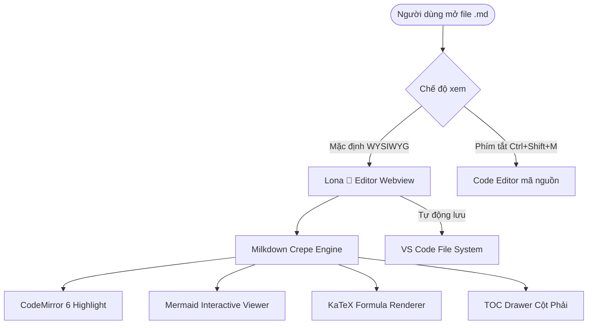
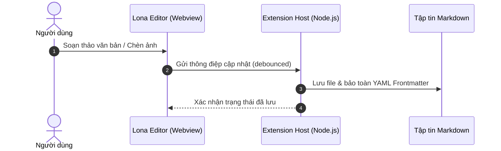

# 🌸 Chào mừng đến với Lona 🩷 Markdown Editor

Trình soạn thảo Markdown trực quan (WYSIWYG) cao cấp được thiết kế riêng cho **Antigravity IDE** và **VS Code**.

***

## 💡 1. Hộp Ghi Chú Thông Minh (Callout Alert Boxes - Tối giản sạch đẹp)

> \[!NOTE]
> **Khung Ghi Chú (Note / Info - Xanh dương)**: Đây là hộp thông tin quan trọng giúp người đọc dễ dàng nắm bắt ngữ cảnh và chi tiết kỹ thuật.

> \[!TIP]
> **Lời Khuyên Hữu Ích (Tip - Xanh lá)**: Bạn có thể gõ phím `/` trong dòng trống để mở **Slash Command Menu** và chọn nhanh các khối nội dung!

> \[!WARNING]
> **Cảnh Báo Lưu Ý (Warning - Vàng cam)**: Hãy kiểm tra cấu hình môi trường Node.js và Git trước khi triển khai ứng dụng vào production.

> \[!CAUTION]
> **Nguy Hiểm & Chú Ý (Danger / Caution - Đỏ)**: Thao tác xóa cơ sở dữ liệu hoặc reset hard Git có thể làm mất dữ liệu vĩnh viễn!

> \[!SUCCESS]
> **Thành Công (Success - Lục bảo)**: Tất cả 127/127 bài kiểm thử đơn vị đã vượt qua thành công! Sẵn sàng bàn giao tính năng.

> \[!IMPORTANT]
> **Quan Trọng (Important - Tím)**: Sử dụng phím tắt `Ctrl+Shift+M` (`Cmd+Shift+M` trên Mac) để chuyển đổi nhanh giữa Text Editor và WYSIWYG.

***

## 🖍️ 2. Tô Màu & Highlight Văn Bản (Multi-color Text Highlights)

Bạn có thể bôi đen bất kỳ đoạn văn bản nào rồi bấm biểu tượng **🖍️ Bút dạ quang Highlight** trên Topbar (hoặc gõ lệnh `/highlight`) để chọn màu tùy thích:

* <mark style="background-color: rgba(250, 204, 21, 0.45);">Highlight màu Vàng (Yellow Accent) cho các điểm nhấn chính</mark>
* <mark style="background-color: rgba(74, 222, 128, 0.45);">Highlight màu Xanh lá (Green Success) cho các trạng thái hoàn thành</mark>
* <mark style="background-color: rgba(96, 165, 250, 0.45);">Highlight màu Xanh dương (Blue Info) cho tài liệu tham khảo</mark>
* <mark style="background-color: rgba(244, 114, 182, 0.45);">Highlight màu Hồng (Pink Love) cho các lưu ý đáng yêu</mark>
* <mark style="background-color: rgba(192, 132, 252, 0.45);">Highlight màu Tím (Purple Royal) cho các thuật toán nâng cao</mark>
* <mark style="background-color: rgba(251, 146, 60, 0.45);">Highlight màu Cam (Orange Warning) cho các cảnh báo quan trọng</mark>
* <mark style="background-color: rgba(248, 113, 113, 0.45);">Highlight màu Đỏ (Red Danger) cho các lỗi cần tránh</mark>

***

## 📋 2. Danh Sách Phân Cấp & Danh Sách Công Việc (Lists & Tasks)

### 🔹 Bullet List 4 Cấp Độ Phân Cấp Notion:

* **Cấp độ 1 (Root - Chấm tròn đặc)**: Nghiên cứu kiến trúc dự án

  * **Cấp độ 2 (Indent 1 - Vòng tròn rỗng)**: Phân tích tầng VS Code Extension Host

    * **Cấp độ 3 (Indent 2 - Hình vuông đặc)**: Xử lý giao tiếp Message Channel 2 chiều

      * **Cấp độ 4+ (Indent 3 - Hình thoi rỗng)**: Tối ưu bộ đệm `_imageUriMaps` và debounce auto-save

    * **Cấp độ 3 (Indent 2 - Hình vuông đặc)**: Quản lý vòng đời CustomEditorProvider

  * **Cấp độ 2 (Indent 1 - Vòng tròn rỗng)**: Nâng cấp giao diện Milkdown Crepe Webview

* **Cấp độ 1 (Root - Chấm tròn đặc)**: Đóng gói và phát hành VSIX

> [!CAUTION]  

### xin chào🔹 Task List (Tick để gạch ngang):

* [x] Chuyển đổi Mục lục (Table of Contents) sang bên phải màn hình
* [x] <br />
* [x] Hệ thống Bullet Shapes phân cấp 4 tầng
* [x] Nâng cấp logo thương hiệu thành Lona 🩷
* [x] Hoàn thiện nhúng Video YouTube & Media Player
* [x] Tích hợp Slash Command Menu phong cách Floating Widget
* [x] Chế độ Phóng to & Kéo xem sơ đồ Mermaid (Zoom & Pan Lightbox)
* [ ] Khám phá thêm các tính năng mở rộng tiếp theo

***

## 📊 3. Sơ Đồ Trực Quan (Mermaid Diagrams)

> *Mẹo: Rê chuột vào sơ đồ để thấy nút **🔍 Phóng to** và nút **📋 Copy Code**, hoặc nhấp đúp vào sơ đồ để mở Lightbox Zoom & Pan toàn màn hình!*





***

## 🔢 4. Công Thức Toán Học (KaTeX Math Formulas)

Công thức nổi tiếng của Einstein: $E = mc^2$ nằm ngay trong dòng văn bản.

Công thức tích phân chuẩn Gaussian phân phối xác suất:

$f(x) = \frac{1}{\sigma \sqrt{2\pi}} e^{-\frac{1}{2}\left(\frac{x-\mu}{\sigma}\right)^2}$

Công thức tổng chuỗi Fourier:

$f(x) = \frac{a_0}{2} + \sum_{n=1}^{\infty} \left[ a_n \cos\left(\frac{2\pi nx}{T}\right) + b_n \sin\left(\frac{2\pi nx}{T}\right) \right]$

***

## 📊 5. Bảng Dữ Liệu (Responsive Markdown Table)

| Tính Năng | Mô Tả Kỹ Thuật | Trạng Thái | Đánh Giá |
| :--- | :--- | :---: | :--- |
| **TOC Drawer** | Nằm bên phải, hỗ trợ kéo dãn và nút Ghim | Hoàn thiện | ⭐⭐⭐⭐⭐ |
| **Slash Menu** | Gõ `/` chèn khối Heading, Callout, Media | Hoàn thiện | ⭐⭐⭐⭐⭐ |
| **Callout 5 Màu** | Note, Tip, Warning, Danger, Success | Hoàn thiện | ⭐⭐⭐⭐⭐ |
| **Mermaid Zoom** | Phóng to Lightbox, cuộn chuột Zoom 1000% | Hoàn thiện | ⭐⭐⭐⭐⭐ |
| **YouTube Embed** | Nhúng video 16:9 responsive góc bo tròn | Hoàn thiện | ⭐⭐⭐⭐⭐ |

***

## 💻 6. Khối Mã Nguồn (Code Blocks với Syntax Highlighting)

```typescript
import { Editor } from "@milkdown/kit/core";
import { CrepeBuilder } from "@milkdown/crepe";

export async function createLonaEditor(container: HTMLElement): Promise<Editor> {
    const crepe = new CrepeBuilder({ root: container });
    console.log("🌸 Khởi tạo Lona 🩷 WYSIWYG Markdown Editor...");
    return await crepe.create();
}
```

```python
def fibonacci(n: int) -> list[int]:
    """Tạo dãy số Fibonacci đến phần tử thứ n"""
    seq = [0, 1]
    while len(seq) < n:
        seq.append(seq[-1] + seq[-2])
    return seq

print("Dãy Fibonacci 10 số đầu:", fibonacci(10))
```

***

## 🎥 7. Nhúng Video & Hình Ảnh (Media Embeds)

### 🎬 YouTube Video Player:

<iframe width="100%" height="420" src="https://www.youtube.com/embed/_2KMHL43bDE" title="YouTube video player" frameborder="0" allow="accelerometer; autoplay; clipboard-write; encrypted-media; gyroscope; picture-in-picture; web-share" referrerpolicy="strict-origin-when-cross-origin" allowfullscreen></iframe>

<https://www.youtube.com/watch?v=_2KMHL43bDE>

### 🖼️ Hình ảnh Trực Tuyến:


***

## ✍️ 8. Trích Dẫn & Phân Cách (Quote & Divider)

> *"Sự đơn giản là tinh hoa tối thượng của sự tinh tế."*\
> — **Leonardo da Vinci**

***

*Tài liệu mẫu được tạo tự động bởi **Antigravity** cho dự án **Lona 🩷**.*
