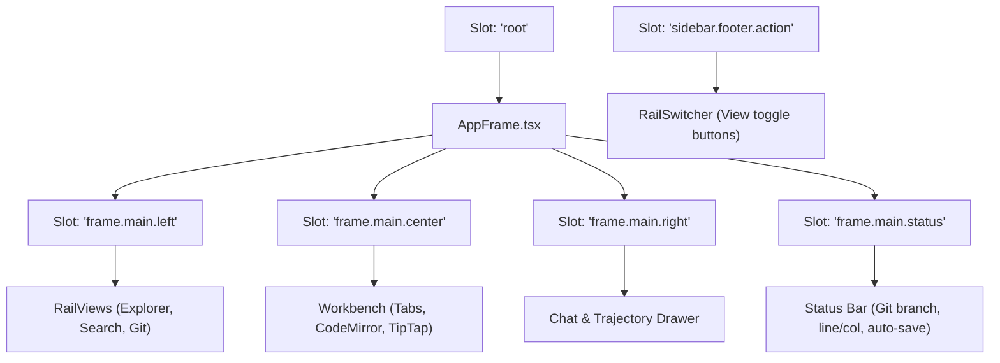
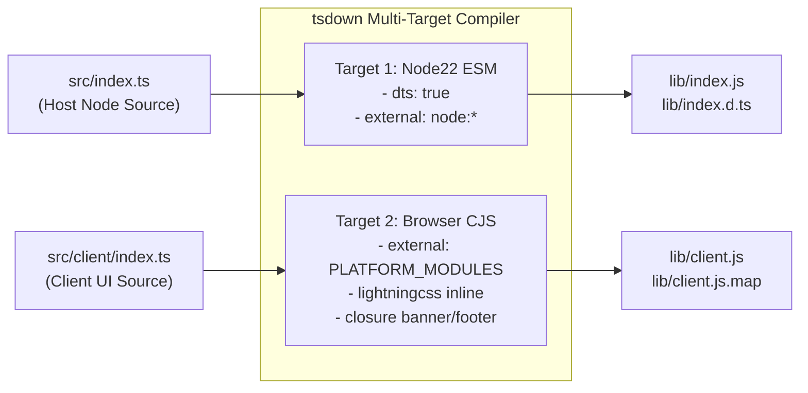

# Architecture & Technical Specification: `@anoslide/dsh-vscode-workspace`

This document provides a comprehensive technical breakdown of `@anoslide/dsh-vscode-workspace`, the unified Dual-Face Cordis plugin for DeepSeek Harness (`dsh`).

---

## 1. Architectural Philosophy: Dual-Face Cordis Model

Historically, workspace capabilities in DeepSeek Harness were split across two distinct packages:
1. `@anoslide/dsh-host-files`: A Node.js backend handling filesystem operations and Git porcelain.
2. `@anoslide/dsh-client-vscode-layout`: A browser frontend bundle delivering the 3-column VS Code shell.

This separation created synchronization overhead, split versioning, brittle multi-step deployment scripts, and risks of API divergence.

`@anoslide/dsh-vscode-workspace` consolidates both domains into a single **Dual-Face** Cordis package:
- **Host Half (`lib/index.js`)**: An ESM Node.js plugin executing in the Cordis backend container, injecting the `webServer` service to serve all `/vscode-files/*` REST endpoints.
- **Client Half (`lib/client.js`)**: A lazy-CJS closure factory consumed by the DeepSeek Harness client module loader (`window.__ModuleLoader__`), injecting slots into the browser runtime.

### Package Manifest Alignment (`package.json`)

The package exports both entrypoints through standard Node module resolution and DeepSeek Harness platform metadata:

```json
{
  "name": "@anoslide/dsh-vscode-workspace",
  "version": "1.0.0",
  "type": "module",
  "main": "lib/index.js",
  "types": "lib/index.d.ts",
  "exports": {
    ".": {
      "types": "./lib/index.d.ts",
      "default": "./lib/index.js"
    },
    "./client": {
      "types": "./lib/index.d.ts",
      "default": "./lib/client.js"
    },
    "./package.json": "./package.json"
  },
  "dsh": {
    "client": {
      "platform": "web",
      "inject": [
        "@deepseek-ai/dsh-client-ui-theme"
      ]
    },
    "bundle": {
      "patch": "./cordis.patch.yml"
    }
  }
}
```

The `cordis.patch.yml` profile layer introduces the plugin cleanly into the runtime bundle list:

```yaml
- insert:
    - id: vscode-workspace
      name: '@anoslide/dsh-vscode-workspace'
```

---

## 2. Host Service Architecture (`src/host/`)

### 2.1 Cordis `webServer` Injection & Lifecycle

The host entrypoint (`src/index.ts`) declares its dependency on the Cordis `webServer` service:

```typescript
import type { Context } from '@deepseek-ai/cordis'
import { registerHostRoutes } from './host/routes.ts'

export const name = 'dsh-vscode-workspace'
export const inject = ['webServer']

export function apply(ctx: Context): void {
  registerHostRoutes(ctx)
}
```

When Cordis initializes the plugin:
1. `registerPersonaPrompt(ctx)`: Hooks into the session controller to inject the workspace persona into the AI agent's system prompt.
2. `ctx.effect(...)`: Binds a route handler prefix `/vscode-files` onto `ctx.webServer`. The lifecycle hook automatically unregisters the route if the plugin is unloaded.

```typescript
export function registerHostRoutes(ctx: Context): void {
  registerPersonaPrompt(ctx)
  const handler = createHostRequestHandler()

  ctx.effect?.(() => {
    return ctx.webServer?.register({
      kind: 'prefix',
      path: '/vscode-files',
      handler,
    }, 'dsh-vscode-workspace: /vscode-files routes')
  })
}
```

### 2.2 Endpoint Specification (`/vscode-files/*`)

All HTTP communication between the client workbench and host service occurs over JSON REST endpoints (with binary streaming for media/raw files).

| Method | Endpoint | Description | Request Parameters / Body | Response Schema |
| :--- | :--- | :--- | :--- | :--- |
| `GET` | `/vscode-files/list` | Lists directory contents and file metadata. | Query: `path` (relative or absolute) | `{ ok: true, path: string, items: Array<{ name, path, isDir, size, mtime }> }` |
| `GET` | `/vscode-files/read` | Reads file content as text. | Query: `path` | `{ ok: true, content: string, binary: false }` or `{ ok: true, binary: true }` |
| `GET` | `/vscode-files/raw` | Streams raw file content with MIME headers. | Query: `path` | Raw byte stream with appropriate `Content-Type` |
| `POST` | `/vscode-files/write` | Atomically writes content to a file. | Body: `{ path: string, content: string }` | `{ ok: true, size: number }` |
| `POST` | `/vscode-files/mkdir` | Creates a new directory recursively. | Body: `{ path: string }` | `{ ok: true, path: string }` |
| `POST` | `/vscode-files/mkfile` | Creates an empty file. | Body: `{ path: string }` | `{ ok: true, path: string }` |
| `POST` | `/vscode-files/rename` | Renames or moves a file or directory. | Body: `{ oldPath: string, newPath: string }` | `{ ok: true }` |
| `POST` | `/vscode-files/delete` | Moves item to OS Trash (or unlinks). | Body: `{ path: string }` | `{ ok: true, trashed: boolean }` |
| `GET` | `/vscode-files/search` | Fast file or content search (`ripgrep`). | Query: `q`, `type` (`filename` \| `content`), `caseSensitive`, `isRegex` | `{ ok: true, results: Array<{ path, line?, preview? }> }` |
| `GET` | `/vscode-files/highlight` | Server-side syntax highlighting with Shiki. | Query: `path`, `theme` (`light` \| `dark`) | `{ ok: true, html: string }` |
| `GET` | `/vscode-files/git` | Retrieves repository status and branch. | Query: `path` (repo path) | `{ ok: true, repo: true, branch: string, staged: [], unstaged: [] }` |
| `GET` | `/vscode-files/git/log` | Returns recent Git commit history. | Query: `path`, `limit` (default 50, max 200) | `{ ok: true, commits: Array<{ hash, message, author, date }> }` |
| `POST` | `/vscode-files/git/stage` | Stages file(s) into Git index. | Body: `{ repo: string, file: string }` | `{ ok: true }` |
| `POST` | `/vscode-files/git/unstage`| Unstages file(s) from Git index. | Body: `{ repo: string, file: string }` | `{ ok: true }` |
| `POST` | `/vscode-files/git/discard`| Discards unstaged modifications. | Body: `{ repo: string, file: string }` | `{ ok: true }` |
| `POST` | `/vscode-files/git/commit` | Creates a Git commit. | Body: `{ repo: string, message: string }` | `{ ok: true, commit: string }` |
| `POST` | `/vscode-files/git/push` | Pushes commits to Git remote. | Body: `{ repo: string }` | `{ ok: true }` |
| `POST` | `/vscode-files/git/pull` | Pulls commits from Git remote. | Body: `{ repo: string }` | `{ ok: true }` |
| `POST` | `/vscode-files/git/fetch`| Fetches updates from Git remote. | Body: `{ repo: string }` | `{ ok: true }` |
| `POST` | `/vscode-files/upload-image` | Uploads an image (local or Cloudflare R2). | Body: `{ file: string (base64), filename: string }` | `{ ok: true, url: string }` |
| `GET` | `/vscode-files/sandbox-info` | Returns current sandbox root and boundaries. | None | `{ ok: true, root: string, isSandboxed: boolean }` |
| `GET` | `/vscode-files/persona` | Reads global workspace persona markdown. | None | `{ ok: true, persona: string }` |
| `POST` | `/vscode-files/persona` | Updates workspace persona markdown. | Body: `{ persona: string }` | `{ ok: true }` |

### 2.3 Security Sandboxing & Path Traversal Guards

All filesystem operations are strictly sandboxed:
1. **Sandbox Root**: Defined by `process.env.DSH_SANDBOX_ROOT` or falling back to `process.cwd()`.
2. **Canonical Resolution**: Incoming paths are resolved using `path.resolve()` and checked against the sandbox root.
3. **Traversal Prevention**:
   ```typescript
   export function isInsideSandbox(targetPath: string, root = getSandboxRoot()): boolean {
     const rel = relative(root, resolve(root, targetPath))
     return !rel.startsWith('..') && !isAbsolute(rel)
   }
   ```
4. Attempts to escape the sandbox boundary immediately reject with `403 Forbidden` (`{ ok: false, error: "Access outside sandbox forbidden" }`).

---

## 3. Client Service & Slot Architecture (`src/client/`)

### 3.1 DeepSeek Harness Micro-Frontend Loader Mechanics

DeepSeek Harness compiles its client-side applications as micro-frontends. The browser runtime provides a frozen module loader: `window.__ModuleLoader__`.

A client plugin bundle must not use generic browser script semantics. Instead, it adheres to the **Lazy-CJS Closure Factory Protocol**:
```javascript
window.__ModuleLoader__.load({
  id: "@anoslide/dsh-vscode-workspace",
  factory: (require) => {
    var module = { exports: {} };
    var exports = module.exports;
    // ... compiled code ...
    return module.exports;
  }
});
```

### 3.2 Platform Modules Alignment (`PLATFORM_MODULES`)

To prevent multiple instances of React hooks, context, or Cordis state engines from co-existing (which causes runtime crashes), the browser runtime provides shared singleton modules via `require(...)`.

Our client build pipeline (`build/tsdown.client.ts`) guarantees that `PLATFORM_MODULES` are never bundled into the client artifact:

```typescript
export const PLATFORM_MODULES = [
  'react',
  'react/jsx-runtime',
  'react-dom',
  'react-dom/client',
  '@deepseek-ai/cordis',
  '@deepseek-ai/dsh-client-store',
  '@deepseek-ai/dsh-client-ui-slots',
  '@deepseek-ai/dsh-client-ui-primitives',
  '@deepseek-ai/dsh-client-ui-dockkit',
] as const
```

The build pipeline enforces a **Purity Gate** (`purityGate` plugin in `build/tsdown.client.ts`). Any value import from `@deepseek-ai/*` that is not in `PLATFORM_MODULES` triggers a compile-time error, ensuring cross-plugin communication occurs strictly via Cordis services and slot registrations.

### 3.3 Slot Composition Model

DeepSeek Harness interfaces are composed entirely of Cordis Slots.



1. **`root` Slot Replacement**:
   `AppFrame.tsx` registers into the built-in `'root'` slot. It declares exclusive render authority over its child slots:
   - `frame.main.left`: Host rail and view panels.
   - `frame.main.center`: Multi-tab workbench editor.
   - `frame.main.right`: AI conversation and tool inspection stream.
   - `frame.main.status`: Bottom status bar.
2. **`sidebar.footer.action` Rail Integration**:
   The native `ui-sidebar` maintains the left-most 56px action rail. Rather than replacing the rail, `@anoslide/dsh-vscode-workspace` seats a toggle button into `sidebar.footer.action` to switch between Explorer, Search, Git, and Sessions.

### 3.4 State Management & Data Channels

In accordance with Cordis client standards, state is partitioned across three explicit channels:
1. **Owner Props**: Downward data passing from parent slot containers.
2. **Local Component State**: Ephemeral UI state (e.g. menu open/closed, hovering, drag handles).
3. **Cordis Stores**: Persistent shared application state created via `createLayoutStore` and `createViewState`, synchronized with the Cordis context.

---

## 4. TipTap Notion WYSIWYG & Editor Subsystem

The center editor workbench (`src/client/tiptap/`) implements a complete Notion-style block editor for Markdown:

```
src/client/tiptap/
├── ai/             # Inline AI assist integration
├── bubble/         # Floating formatting bubble menu
├── callouts/       # Notion-style callout blocks (/callout)
├── clipboard/      # Markdown, HTML, and image paste handlers
├── codeblock/      # Syntax-highlighted code blocks
├── details/        # Collapsible toggle lists (/toggle)
├── dragHandle/     # Block hover drag & drop handles
├── excalidraw/     # Embedded Excalidraw whiteboards
├── findBar/        # In-editor find and replace widget
├── frontmatter/    # YAML frontmatter parser and renderer
├── headingFold/    # Section collapse / fold controls
├── html/           # Safe raw HTML preservation
├── image/          # Image upload and rendering pipeline
├── markdown/       # Bidirectional Markdown AST parser/serializer
├── math/           # KaTeX inline ($...$) and block ($$...$$) math
├── mermaid/        # Live Mermaid diagram renderer
├── table/          # Interactive tables with row/column controls
├── toc/            # Table of Contents outline drawer
└── wiki/           # Internal wiki-link resolution ([[note]])
```

### Key Subsystem Behaviors:
- **Bidirectional Markdown Pipeline**: Automatically transforms raw Markdown into ProseMirror AST nodes and serializes changes back without information loss.
- **Debounced Auto-Save**: An internal 1.5-second debounce automatically syncs dirty documents to the host via `POST /vscode-files/write`.
- **Yjs Collaborative Readiness**: Built-in support for `y-tiptap` collaborative editing and presence cursor tracking over WebSockets.

---

## 5. AI Chat & Reference Protocol

The chat integration (`src/client/chat/`, `src/client/inputTriggers/`) provides a deeply connected AI pair programming workflow:

1. **`@` Mention Provider (`inputTriggers/fileSource.ts`)**:
   Registers into the host's mention autocomplete system. When `@` is typed in the composer, it searches workspace files via `/vscode-files/search` and surfaces candidate files.
2. **Authentic Blue Reference Chips (`OccurrenceChip`)**:
   Selecting a candidate or pressing `Ctrl+L` with code selected inserts an authentic reference chip into the composer. The chip encodes:
   - File path relative to workspace root (`toWorkspaceRelative`).
   - Line range specifier (e.g. `#L15-45`).
   - Clean UI pill styling with click-to-preview capability.
3. **Turn Review Card (`chat/TurnReviewCard.tsx`)**:
   Inspects settled tool calls from the AI session (`extractSettledDiffs.ts`). Any file edits performed by the AI agent render as interactive diff review cards with 1-click apply/revert.
4. **Inline AI Assist (`Ctrl+K`)**:
   Renders a floating prompt above selected editor text, communicating directly with the AI backend to execute polish, formatting, refactoring, or code transformations inline.

---

## 6. Build Pipeline & `tsdown` Engine

The build pipeline is coordinated by `tsdown.config.ts` and `build/tsdown.client.ts`.



### 6.1 Host Target Configuration
- **Entry**: `src/index.ts`
- **Format**: `esm`
- **Target**: `node22`
- **Outputs**: `lib/index.js` (JavaScript) and `lib/index.d.ts` (TypeScript declarations).

### 6.2 Client Target Configuration
- **Entry**: `src/client/index.ts`
- **Format**: `cjs`
- **Platform**: `browser`
- **Outputs**: `lib/client.js` and `lib/client.js.map`.
- **CSS Modules & LightningCSS**:
  - `cssModules()` plugin intercepts `*.module.css` and `*.css`.
  - Transforms styles with `lightningcss`, hashing class names.
  - Injects self-registering `<style data-plugin="@anoslide/dsh-vscode-workspace">` DOM elements on execution.
- **Node Polyfills**:
  - Transparently polyfills `node:crypto` (`randomUUID`, `getRandomValues`) for browser safety.

---

## 7. Deployment Pipeline (`deploy.mjs`)

The deployment script coordinates live installation into a local DeepSeek Harness profile:

1. **Compilation**: Runs `pnpm run build` to generate all artifacts in `lib/`.
2. **Legacy Cleanup**: Invokes `dsh plugin --profile <name> remove <legacy-package>` to prune obsolete `@anoslide/dsh-host-files` and `@anoslide/dsh-client-vscode-layout` entries if present.
3. **Registration**: Invokes `dsh plugin --profile <name> add link:<here>`, which:
   - Resolves package runtime dependencies (`yjs`, `ws`, `lib0`, `y-protocols`).
   - Links the working tree into the profile's `package.json`.
   - Appends `@anoslide/dsh-vscode-workspace` into `dsh.profile.bundles`.
   - Incorporates `cordis.patch.yml` into the boot composition.
