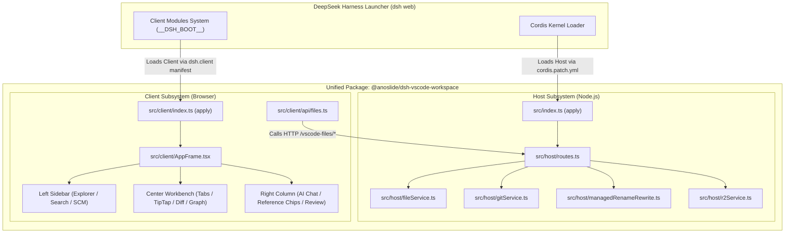

# Design Specification: Unified DSH Dual-Face Plugin Architecture

**Document:** `docs/superpowers/specs/2026-09-11-dsh-plugin-standardization-design.md`  
**Date:** 2026-09-11  
**Status:** Approved by User  
**Target Platform:** DeepSeek Harness (`dsh`) v0.1.5-rc.2+ (Node.js 22+, Cordis 4+, Web Client)

---

## 1. Executive Summary & Problem Statement

### 1.1 Context
The `deepseek-harness-plugins` repository currently provides a rich 3-column VS Code layout and TipTap Notion WYSIWYG editor for DeepSeek Harness (`dsh`). However, the project layout suffered from fragmentation and legacy cruft:
1. **Unused 3rd-party baggage**: The `plugins/dsh-task-board` folder was a leftover patch script for `@linxin666/dsh-client-ui-task-board` that was neither imported nor utilized.
2. **Missing Backend Source**: The backend service in `plugins/dsh-host-files` was committed only as compiled JavaScript (`lib/*.js`), lacking TypeScript source code and type safety.
3. **Double Plugin Deployment**: The repository forced operators to install two distinct plugins (`@anoslide/dsh-host-files` and `@anoslide/dsh-client-vscode-layout`) simultaneously into `~/.dsh/profiles/web/`, requiring manual link management and confusing workspace boundaries.
4. **Obsolete Build Artefacts**: The repository root contained legacy scripts, notably `build-unified-vscode-layout.mjs` (a 208 KB, 4,275-line regex-replacement script from early prototypes), redundant rollup scripts, and orphaned config files.
5. **DSH v0.1.5 Compatibility**: DSH has updated from `0.1.3-alpha.1` to `0.1.5-rc.2`, requiring aligned `PLATFORM_MODULES` (`@deepseek-ai/dsh-client-ui-dockkit`) and modern plugin declaration standards.

### 1.2 Objective
Transform this repository into a single, canonical, professional, 100% TypeScript DSH **Dual-Face Plugin** (`@anoslide/dsh-vscode-workspace`). The plugin will cleanly encapsulate both the Node.js Host backend services and the Browser Web Client layout in a unified package with zero third-party debris, automated testing, and single-step deployment (`dsh plugin --profile web add link:.`).

---

## 2. Architectural Design



### 2.1 The Dual-Face Cordis Model
In DeepSeek Harness, a full-featured plugin operates across two execution environments:
1. **Node.js Host Environment**: Cordis mounts the plugin package via its root export (`.` -> `lib/index.js`), passing a `Context` with injected services (`inject: ['webServer']`).
2. **Browser Client Environment**: `dsh-client-modules` inspects the package manifest's `"dsh": { "client": { "platform": "web" } }` declaration and mounts `./client` (`lib/client.js`) into the browser's lazy-CJS module system.

By integrating both halves into one package:
- The Host mounts `/vscode-files/*` on the existing `webServer` service.
- The Client consumes `/vscode-files/*` via `src/client/api/files.ts`.
- The user installs **one** plugin, boots **one** bundle layer, and has zero inter-package synchronization issues.

---

## 3. Directory Layout & Module Structure

```text
deepseek-harness-plugins/
├── cordis.patch.yml                    # Single profile layer patch
├── package.json                        # Unified package manifest
├── tsconfig.json                       # Unified TypeScript project config
├── tsdown.config.ts                    # Dual-target build (Host lib/index.js + Client lib/client.js)
├── src/
│   ├── index.ts                        # Host entry point (Cordis apply(ctx))
│   ├── host/                           # Backend services (TypeScript)
│   │   ├── types.ts                    # Strongly typed API contracts
│   │   ├── routes.ts                   # Route handler for /vscode-files/*
│   │   ├── fileService.ts              # File read, write, create, delete, raw stream
│   │   ├── gitService.ts               # Git status, stage, unstage, commit, discard
│   │   ├── managedRenameRewrite.ts     # Wiki-link & markdown link auto-healing
│   │   ├── r2Service.ts                # S3/Cloudflare R2 image asset uploader
│   │   └── personaService.ts           # Persona file read/write (~/.dsh/global-persona.md)
│   └── client/                         # Frontend UI (React + Cordis Web)
│       ├── index.ts                    # Client entry point (registers slots & shortcuts)
│       ├── AppFrame.tsx                # 3-column VS Code frame
│       ├── api/                        # Client API connectors
│       │   └── files.ts                # Typed client for /vscode-files/*
│       ├── workbench/                  # Tab manager, active editor router
│       ├── explorer/                   # File tree, search panel, git SCM panel
│       ├── editor/                     # TipTap Notion WYSIWYG, CodeMirror, KaTeX, Mermaid
│       ├── chat/                       # AI inline assist (Ctrl+K), reference chips, turn review
│       ├── diff/                       # Rendered visual diff & side-by-side diff
│       ├── graph/                      # Interactive knowledge graph (wiki-links)
│       ├── excalidraw/                 # Excalidraw vector scene preview & whiteboard
│       └── shortcuts/                  # VS Code keybinding engine (Ctrl+P, Ctrl+B, Ctrl+L, etc.)
├── tests/
│   ├── host/                           # Host unit tests
│   │   ├── managed-rename.test.ts      # Link healing algorithm verification
│   │   └── routes.test.ts              # Security & sandbox boundary tests
│   └── client/                         # Client unit tests
├── docs/                               # Developer documentation & specifications
│   ├── architecture.md                 # Complete technical architecture reference
│   └── superpowers/specs/              # Historical and feature design specs
└── README.md                           # Modern, comprehensive README
```

---

## 4. Subsystem Specifications

### 4.1 Host Subsystem (`src/host/`)
- **Cordis Injection**:
  ```typescript
  export const name = 'dsh-vscode-workspace'
  export const inject = ['webServer']
  export function apply(ctx: Context): void {
    registerHostRoutes(ctx)
  }
  ```
- **Endpoints Provided**:
  - `GET /vscode-files/list`: Directory listing with recursive stats, folder-first sorting, dotfile classification.
  - `GET /vscode-files/read`: Bounded file read (up to 2 MB) with binary-safety checks (`looksBinary`).
  - `POST /vscode-files/write`: File writes (10 MB limit) strictly validated within `SANDBOX_ROOT`.
  - `POST /vscode-files/mkdir`, `POST /vscode-files/mkfile`: Directory and empty file creation.
  - `POST /vscode-files/rename`: Atomic file/directory move with link healing.
  - `POST /vscode-files/delete`: Safe trash/recycle-bin deletion.
  - `GET /vscode-files/search`: Fast recursive full-text regex/literal grep across workspace files.
  - `GET /vscode-files/git/status`: Live git porcelain status, active branch, ahead/behind counters.
  - `POST /vscode-files/git/stage`, `POST /vscode-files/git/unstage`: Git index operations.
  - `POST /vscode-files/git/commit`, `POST /vscode-files/git/discard`: Git change control.
  - `GET /vscode-files/raw`: Direct streaming of media files (PNG, JPEG, WebP, SVG, MP4, fonts) with appropriate Content-Type headers.
  - `POST /vscode-files/upload-image`: Direct upload to Cloudflare R2 object storage.
  - `GET / POST /vscode-files/persona`: Reads/writes user persona into `~/.dsh/global-persona.md`.
- **Security & Sandboxing**:
  All file mutations assert that the resolved target path begins with `SANDBOX_ROOT` (`process.env.DSH_SANDBOX_ROOT || process.cwd()`). Path traversal attempts (`../../`) return `403 Forbidden`.

### 4.2 Client Subsystem (`src/client/`)
- **DSH Client Manifest**:
  `package.json` declares:
  ```json
  "dsh": {
    "client": {
      "platform": "web",
      "inject": ["@deepseek-ai/dsh-client-ui-theme"]
    },
    "bundle": {
      "patch": "./cordis.patch.yml"
    }
  }
  ```
- **Shared Platform Modules (`PLATFORM_MODULES`)**:
  Build externalization matches upstream DSH v0.1.5-rc.2:
  `['react', 'react/jsx-runtime', 'react-dom', 'react-dom/client', '@deepseek-ai/cordis', '@deepseek-ai/dsh-client-store', '@deepseek-ai/dsh-client-ui-slots', '@deepseek-ai/dsh-client-ui-primitives', '@deepseek-ai/dsh-client-ui-dockkit']`.
- **UI Integration**:
  Replaces stock layout with `AppFrame.tsx`, maintaining the 56px host rail while injecting VS Code Explorer, Multi-Tab Editor, TipTap WYSIWYG, and Chat Assistant.

---

## 5. Build Pipeline (`tsdown.config.ts`)

A single, unified `tsdown.config.ts` configuration replaces all previous fragmented scripts:
1. **Target 1: Node.js Host Library**:
   - Compiles `src/index.ts` -> `lib/index.js` (ESM).
   - Generates declaration types `lib/types/index.d.ts`.
2. **Target 2: Web Client Bundle**:
   - Compiles `src/client/index.ts` -> `lib/client.js` (Lazy-CJS factory format: `window.__ModuleLoader__.load({ id, factory })`).
   - Bundles CSS Modules using `lightningcss`, auto-injecting `<style data-plugin="@anoslide/dsh-vscode-workspace">`.
   - Externalizes all entries in `PLATFORM_MODULES`.
3. **Execution**:
   `pnpm build` executes `tsc --build` followed by `tsdown`. The entire build takes ~3 seconds.

---

## 6. Cleanup & Migration Plan

1. **Delete obsolete third-party directory**:
   - `plugins/dsh-task-board/` -> Delete completely.
2. **Migrate Host Backend to TypeScript**:
   - `plugins/dsh-host-files/lib/index.js` -> Refactor into `src/host/routes.ts`, `src/host/fileService.ts`, `src/host/gitService.ts`.
   - `plugins/dsh-host-files/lib/managedRenameRewrite.js` -> Port to `src/host/managedRenameRewrite.ts`.
   - `plugins/dsh-host-files/lib/r2Service.js` -> Port to `src/host/r2Service.ts`.
   - Create `src/host/types.ts` for unified request/response types.
   - Delete `plugins/dsh-host-files/`.
3. **Migrate Client Frontend**:
   - Move `plugins/dsh-client-vscode-layout/src/client/` to `src/client/`.
   - Update imports and ensure types are shared with `src/host/types.ts`.
   - Delete `plugins/dsh-client-vscode-layout/`.
   - Remove `plugins/` directory.
4. **Delete Root Legacy Files**:
   - Remove `build-unified-vscode-layout.mjs` (208 KB legacy regex file).
   - Remove `build-tiptap.mjs`.
   - Remove `pnpm-workspace.yaml`.
5. **Update Root Configuration**:
   - Update `package.json` with unified metadata, dependencies, and build scripts.
   - Update `cordis.patch.yml`.
   - Update `deploy.mjs`.

---

## 7. Verification & Quality Gates

1. **Typecheck Gate**: `pnpm typecheck` (`tsc --noEmit`) passes with 0 errors across Host and Client code.
2. **Unit Test Gate**: `pnpm test` executes tests for `managedRenameRewrite` and Host route sandboxing.
3. **Build Gate**: `pnpm build` generates `lib/index.js` and `lib/client.js` cleanly with no warnings or missing externals.
4. **Integration Gate**: `node deploy.mjs` successfully installs the unified plugin into `~/.dsh/profiles/web/` via `dsh plugin --profile web add link:.` and verifies `dsh web` boots without errors.

---

## 8. Rollout Checklist
- [ ] Migrate and clean code according to Section 6.
- [ ] Implement unit tests in `tests/host/`.
- [ ] Run typecheck and automated tests.
- [ ] Verify deployment to local DSH profile.
- [ ] Update documentation (`README.md` and `docs/architecture.md`).
