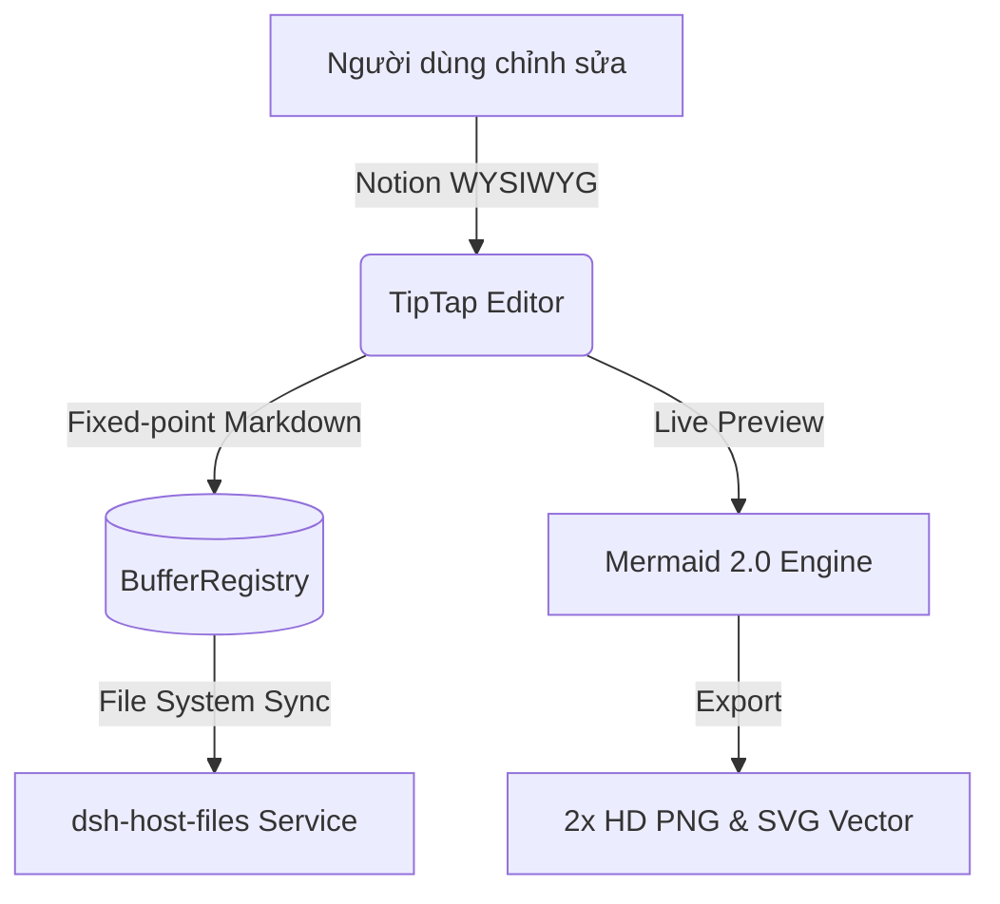

# DeepSeek Notion Workspace & Knowledge Base

Chào mừng bạn đến với trình soạn thảo Markdown WYSIWYG thế hệ mới được nâng cấp toàn diện dựa trên kiến trúc của `epytor`.

> [!NOTE]
> Trình soạn thảo này hỗ trợ tính năng **Fixed-point Normalization** độc quyền: tài liệu Markdown khi lưu sẽ luôn được chuẩn hoá tự động, hoàn toàn triệt tiêu các ký tự rác như `<br />` hay `&#x20;`.

> [!TIP]
> Bạn có thể nhấn `/` ở đầu dòng bất kỳ để mở **Slash Command Palette** với đầy đủ các khối nội dung: Mermaid, LaTeX Math, Video Player, Callout, Table, v.v.

---

## 1. Tính Năng Gập Tiêu Đề (Heading Fold)

Khi di chuột vào các tiêu đề H1-H6, bạn sẽ thấy biểu tượng mũi tên cho phép **thu gọn (collapse)** hoặc **mở rộng (expand)** toàn bộ phần nội dung bên dưới, giúp quản lý các tài liệu dài dễ dàng.

---

## 2. Mermaid Diagram 2.0 (Vector SVG & Xuất PNG HD)



---

## 3. Công Thức Toán Học LaTeX KaTeX

$$f(x) = \int_{-\infty}^{\infty} \frac{1}{\sigma \sqrt{2\pi}} e^{-\frac{(x-\mu)^2}{2\sigma^2}} dx = 1$$

* Hỗ trợ công thức inline `$formula$` và khối hiển thị `$$formula$$`.
* Bấm vào công thức để chỉnh sửa trực tiếp, hỗ trợ xem trước thời gian thực.

---

## 4. Quản Lý Công Việc & Bảng Dữ Liệu

* [x] Kích hoạt pnpm 9.15.9 & tương thích Node 20
* [x] Tích hợp Mermaid 2.0 với theme HSL Dark/Light & modal Pan/Zoom
* [x] Tích hợp KaTeX LaTeX Math Node
* [x] Hỗ trợ gập tiêu đề Heading Fold
* [x] Callout chuẩn GitHub Alert với icon vector
* [x] Highlight Palette đa sắc màu & Text Alignment
* [x] Bộ xử lý làm sạch Markdown chống sinh thẻ `<br />`

| Tính năng | Trạng thái | Nguồn tham khảo |
| :--- | :---: | :--- |
| **Mermaid 2.0** | Hoàn thành ✓ | `epytor/webview/plugins/mermaidTheme.ts` |
| **LaTeX KaTeX** | Hoàn thành ✓ | `epytor/webview/extensions` |
| **Heading Fold** | Hoàn thành ✓ | `epytor/webview/plugins/headingFoldPlugin.ts` |
| **GitHub Alerts** | Hoàn thành ✓ | `epytor/webview/plugins/calloutPlugin.ts` |
| **R2 Storage** | Hoàn thành ✓ | `epytor/src/utils/r2Service.ts` |

---

## 5. Khối Code Với 1-Click Copy

```typescript
import { serializeStable } from './markdown.ts'

export function saveDocument(editor: Editor): string {
  const cleanMarkdown = serializeStable(editor)
  return cleanMarkdown
}
```
